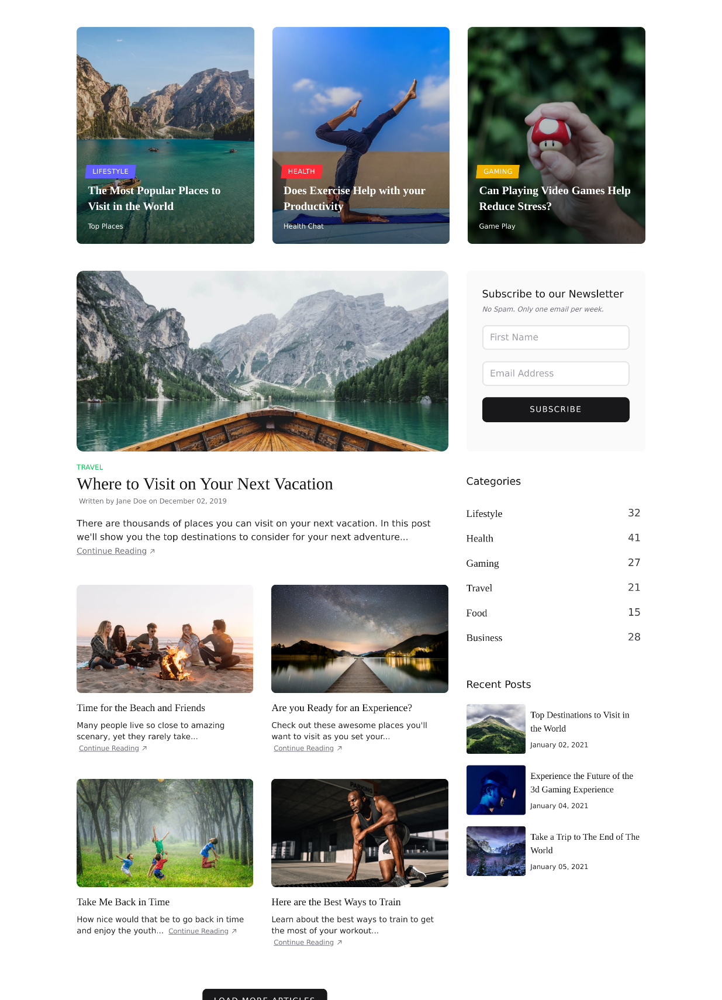
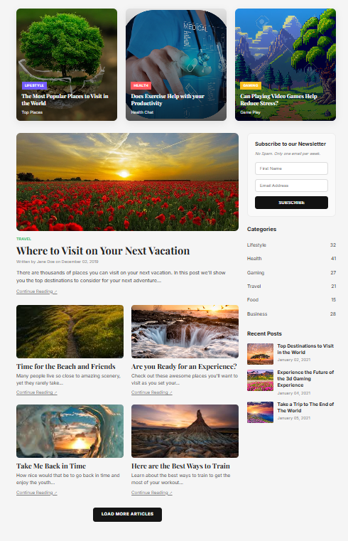

# Proyecto Clon Web

## Autor
Alexander Umaña Guevara

## Descripción
Este proyecto replica un diseño web usando CSS Grid y Flexbox.

## Página original

## Resultado final

## Tecnologías usadas
- HTML
- CSS (Grid y Flexbox)

##  Responsive
El diseño se adapta a móvil y escritorio.